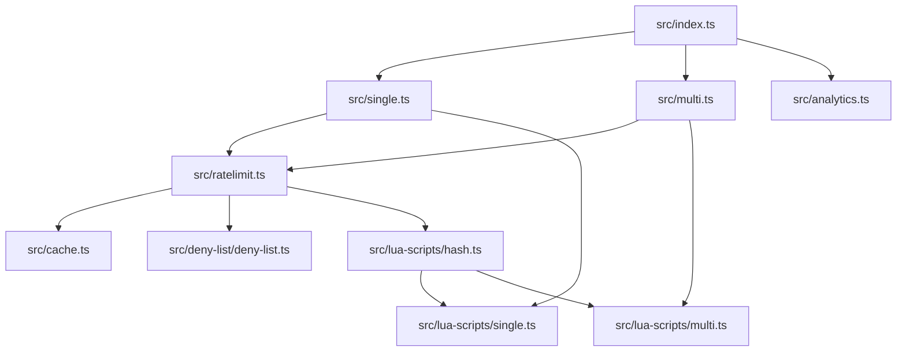

The library is organized around a small core `Ratelimit` class in `src/ratelimit.ts`, with algorithm factories in `src/single.ts` and `src/multi.ts`, and Lua scripts in `src/lua-scripts/` for atomic Redis operations. The entry point `src/index.ts` re-exports the public API as `Ratelimit`, `MultiRegionRatelimit`, `Analytics`, and type helpers.

**Key design decisions and why they exist**
- **Algorithm factories return a uniform interface.** `AlgorithmTContext>` in `src/types.ts` defines `limit`, `getRemaining`, and `resetTokens`. Both `RegionRatelimit` (`src/single.ts`) and `MultiRegionRatelimit` (`src/multi.ts`) produce factories that match this shape so the core `Ratelimit` class can call them without caring about the algorithm type. This keeps the public API stable while allowing new algorithms to be added.
- **Lua scripts for atomicity and performance.** All heavy operations happen in `src/lua-scripts/` to make Redis mutations and reads atomic. `safeEval` in `src/hash.ts` uses `EVALSHA` and falls back to loading the script when missing. This keeps network overhead low and avoids race conditions across concurrent requests.
- **Ephemeral cache is optional and local.** `src/cache.ts` is a simple `Map` wrapper used to block identifiers without hitting Redis. This is valuable in serverless and edge contexts where repeated blocked requests are common and latency matters. The cache is intentionally ephemeral so it never becomes a source of truth.
- **Protection (deny list) is layered.** `src/deny-list/deny-list.ts` checks a local deny list cache first, then consults Redis via a Lua script. This means known-bad identifiers can be rejected without a Redis read, and Redis becomes the source of truth for global deny lists.
- **Analytics is decoupled.** `src/analytics.ts` wraps `@upstash/core-analytics` and is triggered from `Ratelimit.submitAnalytics`. This keeps the limit path fast and ensures analytics is asynchronous via the `pending` promise in the response.

**How a limit check flows**
1. `Ratelimit.limit` in `src/ratelimit.ts` calls `getRatelimitResponse`, which builds a Redis key and collects deny list candidates (identifier, IP, user agent, country).
2. If protection is enabled, `checkDenyList` in `src/deny-list/deny-list.ts` runs a Lua script to check all deny list sets. If a deny list value is found, the response is overridden before returning.
3. The algorithm factory from `src/single.ts` or `src/multi.ts` executes `safeEval` in `src/hash.ts`, which runs the matching Lua script from `src/lua-scripts/`.
4. The algorithm returns `{ success, remaining, reset, pending }`. For multi-region algorithms, `pending` includes background synchronization to reconcile state across regions.
5. If analytics is enabled, `submitAnalytics` attaches another async task to `pending` and returns the final response immediately.

**Data flow at a glance**
- **Single region**: `Ratelimit.limit` → algorithm `limit` → Lua script → Redis → response → optional analytics.
- **Multi region**: `Ratelimit.limit` → algorithm `limit` → Lua script in each region → first response wins → async sync to reconcile regions.

The result is a small, composable architecture where the public API stays simple, and all heavy lifting is performed atomically at Redis with minimal overhead in the caller.
