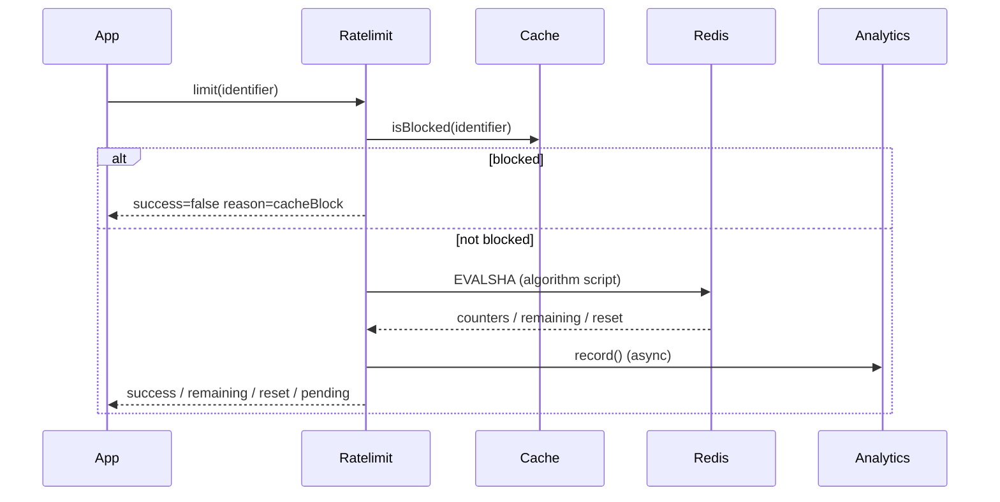

This page explains the runtime lifecycle of a single `limit()` call, from cache checks to Redis scripts to analytics submission. The orchestration logic is in `src/ratelimit.ts`, while cache behavior lives in `src/cache.ts` and Lua scripts live in `src/lua-scripts/`.



## Core flow in `Ratelimit.limit`
`limit()` is implemented in `src/ratelimit.ts`. It builds a namespaced Redis key, optionally checks deny list values, executes the algorithm’s Lua script, and then attaches analytics work to the `pending` promise. This `pending` field is important in edge runtimes where you must explicitly keep background work alive.

**Basic usage**
```ts title="app/api/route.ts"
const res = await ratelimit.limit("user_123");
if (!res.success) {
  return new Response("Too Many Requests", { status: 429 });
}
return new Response("ok");
```

**Edge usage with `pending`**
```ts title="app/api/route.ts"
import { waitUntil } from "@vercel/functions";

const res = await ratelimit.limit("api");
waitUntil(res.pending);
```

## Timeout behavior
`Ratelimit.limit` wraps the actual work in a `Promise.race` with a timeout promise when `timeout` is set. If the timeout fires first, the response is treated as a successful request with `reason: "timeout"` and `reset: 0`. This is deliberate so you can choose availability over strict enforcement in failure scenarios.

**Example with a short timeout**
```ts title="app/ratelimit.ts"
const ratelimit = new Ratelimit({
  redis: Redis.fromEnv(),
  limiter: Ratelimit.slidingWindow(10, "10 s"),
  timeout: 250
});
```

## Cache behavior
The optional `ephemeralCache` is created in the constructor of `Ratelimit` when you pass a `Map` or leave it undefined. `src/cache.ts` stores `identifier -> reset` pairs. If a request is already blocked and the reset time hasn’t passed, the cache short‑circuits the Redis call and responds immediately with `reason: "cacheBlock"`.

When a request succeeds after a refund (negative `rate`), the cache is cleared for that identifier to prevent accidental blocking.

<Callout type="warn">If you instantiate `Ratelimit` inside a request handler in serverless runtimes, the cache is recreated on every request and provides no value. Create the instance outside the handler so the cache survives while the function is hot.</Callout>

<Accordions>
<Accordion title="Timeouts vs Strict Enforcement">
Setting `timeout` to a low value favors availability, especially in edge or mobile environments where network jitter can cause Redis calls to slow down. However, timeouts return `success: true` with `reason: "timeout"`, which may allow requests that would otherwise be blocked. If your API is sensitive to abuse, prefer a higher timeout or disable it entirely. Consider using `blockUntilReady` for queues where delaying is acceptable.
</Accordion>
<Accordion title="Ephemeral Cache Trade-offs">
The cache reduces Redis traffic and latency for repeated blocked identifiers, which is ideal for bursty traffic. Because it is local and short‑lived, it is not a source of truth and can drift across regions or isolates. If you run multiple instances, each instance has its own cache and can allow slightly more requests than the global limit. Use it as an optimization, not a guarantee.
</Accordion>
<Accordion title="Pending Work in Edge Runtimes">
`pending` collects background work such as multi‑region synchronization and analytics submission. If you ignore it in edge runtimes, the work may be canceled when the request completes. In Node.js you can usually ignore it, but in Cloudflare Workers or Vercel Edge you should call `context.waitUntil(pending)` or `waitUntil(pending)`. The trade-off is a small amount of additional work after the response is returned, which is usually acceptable for analytics and sync tasks.
</Accordion>
</Accordions>
