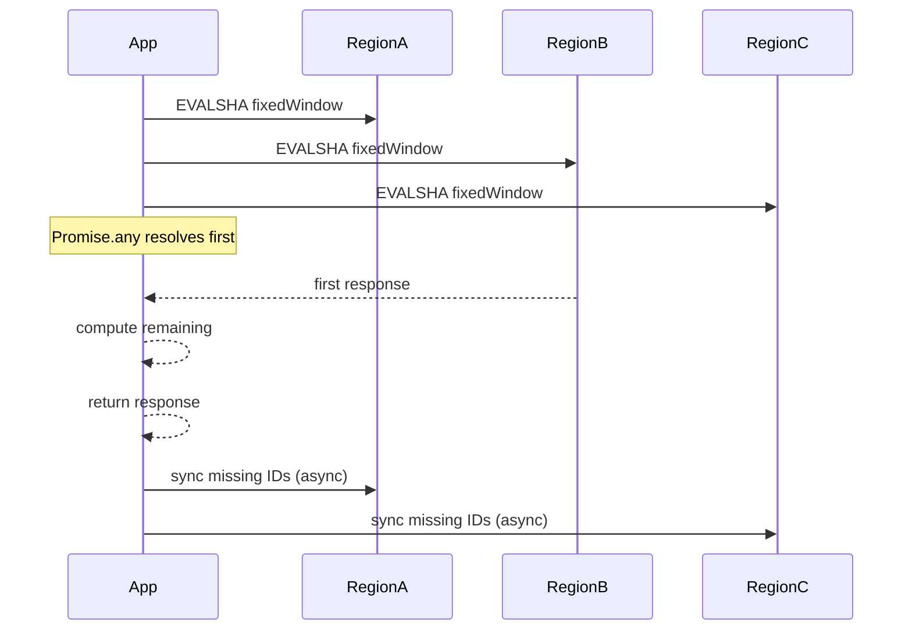

Multi‑region rate limiting is implemented in `src/multi.ts` as `MultiRegionRatelimit`. It uses multiple Redis instances (one per region) and combines their responses to enforce a global limit with low latency. The key idea is to accept the first region to respond, then synchronize the others asynchronously.



## How it works internally
- **Request IDs**: `randomId()` in `src/multi.ts` generates a short unique ID per request. This ID becomes a field in a Redis hash (`HSET`), which makes it possible to reconcile entries across regions.
- **First response wins**: The algorithm uses `Promise.any` across region requests. This keeps latency low by returning as soon as any region responds.
- **Background sync**: After the response is returned, the `pending` promise performs a synchronization pass that compares all region hashes and inserts missing request IDs so each region eventually converges.

The fixed window implementation uses `SCRIPTS.multiRegion.fixedWindow.*` in `src/lua-scripts/multi.ts`, while the sliding window implementation uses `SCRIPTS.multiRegion.slidingWindow.*` and performs a weighted blend of current and previous windows, similar to the single‑region version.

## Basic usage
```ts title="app/ratelimit.ts"
import { MultiRegionRatelimit } from "@upstash/ratelimit";
import { Redis } from "@upstash/redis";

const ratelimit = new MultiRegionRatelimit({
  redis: [Redis.fromEnv(), Redis.fromEnv()],
  limiter: MultiRegionRatelimit.fixedWindow(100, "1 m")
});

const res = await ratelimit.limit("api_key_123");
```

## Advanced usage (edge runtime with `pending`)
```ts title="app/api/route.ts"
import { waitUntil } from "@vercel/functions";

const res = await ratelimit.limit("api_key_123");
waitUntil(res.pending);
```

<Callout type="warn">Multi‑region limiters use background synchronization for eventual consistency. If you ignore the `pending` promise in edge runtimes, regions can drift longer than expected, causing temporary limit inflation.</Callout>

<Accordions>
<Accordion title="Latency vs Consistency">
Multi‑region mode optimizes latency by returning the first response, which is perfect for global applications. The trade‑off is that the limit is eventually consistent until the sync task completes. This is acceptable for many APIs but can be problematic when strict global quotas are required. If you need absolute consistency, use a single region or design the API to tolerate short bursts.
</Accordion>
<Accordion title="Hash-Based Request Tracking">
Using request IDs stored in Redis hashes enables deterministic reconciliation, but it increases storage overhead compared to simple counters. For high throughput identifiers, the hash can grow during the window and requires careful TTL management, which the Lua scripts handle by setting expirations on first write. This approach is a pragmatic compromise: accurate per-request tracking with eventual cleanup. It also simplifies multi-region merging compared to vector clocks or distributed locks.
</Accordion>
<Accordion title="Sliding Window in Multi-Region">
Sliding window in multi‑region stores each request ID in the current bucket and reads both current and previous hashes for weighting. This gives you smoother boundaries, but it doubles the read path and increases hash size. In regions with high latency, the cost of reading both hashes can be noticeable. Use it when boundary spikes are a real concern and fixed window is not sufficient.
</Accordion>
</Accordions>
